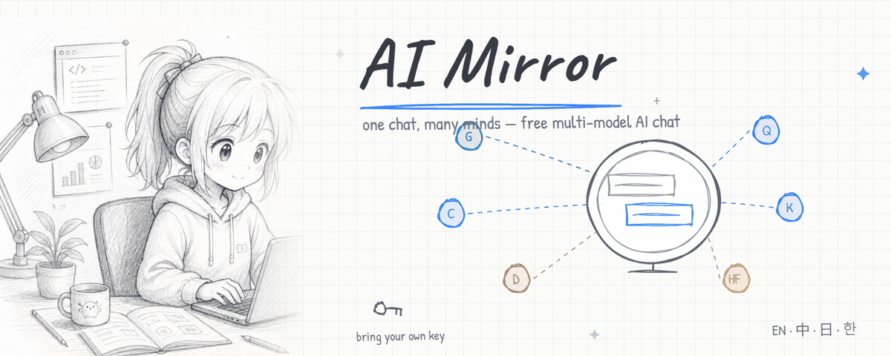

<div align="center">



# ✦ AI Mirror

**Free multi-model AI chat for everyone — including users in mainland China.**

ChatGPT · Gemini · Claude · DeepSeek · Qwen · GLM · Kimi · MiniMax · Doubao · ERNIE · Hugging Face
— all in one web app, each with its own brand-matched aesthetic.

🌐 **English** · [中文](README.zh.md) · [日本語](README.ja.md) · [한국어](README.ko.md)

[](https://vercel.com/new/clone?repository-url=https://github.com/appleweiping/ai-mirror)

</div>

---

## What it is

A single, clean web UI that lets anyone chat with 11+ frontier/open models and switch
between them instantly. Pick a model and **the entire interface restyles** to that
brand's real visual language — OpenAI green, Gemini's blue→purple aurora, Claude's
warm clay, DeepSeek deep-blue, Hugging Face amber, and so on.

It runs **entirely on Vercel** (static frontend + edge functions). **No separate
server is required** — which makes it the most reliable possible deploy and means
nothing else needs to be hosted or maintained.

## How "free" works (read this)

There is no truly free *ChatGPT API* — OpenAI removed its free tier and every call
costs money. So AI Mirror gives you three honest paths, mixable per provider:

| Path | What it means | Cost |
|------|---------------|------|
| **BYOK** (default) | Users paste their own API key in Settings. Stored only in their browser's localStorage, never uploaded to us, forwarded directly to the provider. | Free to host; user pays provider |
| **Free tiers** | Gemini, Qwen, GLM (`glm-4-flash`), and ERNIE (`ernie-speed`) have genuine official free tiers — flagged 🆓 in the UI. | Actually free |
| **Operator keys / relay** | You set provider keys (or one OpenAI-compatible relay URL) in Vercel env vars; those models then work for visitors with no key needed. | You pay, or relay does |

**Gemini is the closest to a real free ChatGPT-style experience**, because Google
still offers a free tier. The relay path can approximate "free ChatGPT" but may
violate provider ToS and is unstable — use at your own risk.

## Features

- **11 providers, 1 UI** — OpenAI-compatible protocol for nearly all; Claude's
  `/v1/messages` is translated transparently so the browser speaks one format.
- **Model picker + override** — choose from each provider's model list or enter
  a custom model/endpoint ID for Doubao, relays, and Hugging Face routes.
- **Better chat ergonomics** — quick prompts, stop generation, copy answers,
  clear per-provider conversations, and clear "needs key" guidance.
- **Per-brand theming** — switching a model flips a full light/dark theme.
- **Token-by-token streaming** via Server-Sent Events.
- **BYOK, private** — keys live in your browser only; the proxy uses them for one
  upstream call and never logs or stores them.
- **4 languages** — 中文 / English / 日本語 / 한국어, auto-detected, switchable.
- **Per-model chat history** kept locally.

## Deploy to Vercel (no server needed)

1. **Fork / push this repo to GitHub** (already done at `appleweiping/ai-mirror`).
2. Go to [vercel.com/new](https://vercel.com/new), **Import** the repo. Vercel
   auto-detects `vercel.json`; no settings to change. Click **Deploy**.
3. *(Optional)* In **Project → Settings → Environment Variables**, add any keys
   from [`.env.example`](.env.example) to make those models work without users
   bringing their own. All are optional — with none set, the app runs in pure
   BYOK mode and still works.

That's it. Every `git push` re-deploys automatically. Full guide:
[`docs/DEPLOY.md`](docs/DEPLOY.md).

## Local development

Use Vercel CLI locally so `/api/models` and `/api/chat` run next to the static UI:

```bash
npm run dev
```

The app opens at `http://localhost:3000`. `npm run dev:static` is only a static
preview; chat and provider availability will be disabled because `/api/*` is not
running.

## Architecture

```
public/            static frontend (no framework, no build)
  index.html       shell
  app.js           state, streaming SSE client, theme/model/key UX
  styles.css       layout + components (CSS-variable driven)
  themes.css       11 brand themes × light/dark
  i18n.js          zh / en / ja / ko strings
  assets/          generated banner and static visual assets
api/               Vercel edge functions
  _providers.js    provider registry + auth resolution (BYOK→env→relay)
  chat.js          streaming proxy; OpenAI + Anthropic protocols → unified SSE
  models.js        catalog + per-provider availability for the UI
build.js           asset sanity check (static, nothing to compile)
vercel.json        framework=null, edge runtime
```

**Auth resolution** (per request, in `_providers.js`): user's BYOK key →
operator's env key → optional relay. A provider shows as "Ready" if a server key
or relay is configured, "Free" if it has an official free tier, else "Bring key".

## Security notes

- BYOK keys are stored in `localStorage` and sent only via the `X-User-Key`
  header to our edge function, which forwards them to the provider over HTTPS and
  never logs or persists them.
- The chat endpoint is intentionally open (it's a public proxy). If you set
  operator keys, **anyone who finds your URL can spend them** — prefer BYOK + free
  tiers for a public deploy, or add your own rate limiting / auth before exposing
  operator keys.

## License

MIT — see [LICENSE](LICENSE).
